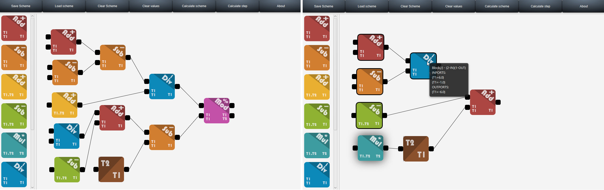

# IJA-Project

> **Autoři:** 	Tomas Kunickij && Maros Orsak

### Screenshots

### Základní požadavky
aplikace umožní vytvářet, editovat, ukládat a načítat bloková schémata
každé schéma má svůj jedinečný název
vytvořená schémata lze uložit a opětovně načíst
schéma je složeno z bloků a propojů mezi bloky

### Bloky
každý blok má definované vstupní a výstupní porty
s každým portem je spojen typ, který je reprezentován množinou dat v podobě dvojic název->hodnota; hodnota bude vždy typu double
bloky je možné spojit pouze mezi výstupním a vstupním portem
každý blok obsahuje výpočet (vzorce), které transformují hodnoty ze vstupních portů na hodnoty výstupních portů

### Propojení mezi bloky
systém kontroluje kompatibilitu vstupního a výstupního portu propoje (stejný typ dat)
typ dat je přiřazen propoji automaticky podle spojených portů

###  Výpočet
po sestavení (načtení) schématu je možné provést výpočet
systém detekuje cykly v schématu; pokud jsou v schématu cykly, nelze provést výpočet
systém požádá o vyplnění dat vstupních portů, která nejsou napojena a poté postupně provádí výpočty jednotlivých bloků podle definovaných vzorců v každém bloku
při výpočtu se vždy zvýrazní blok, který je právě přepočítáván
výpočet lze krokovat (jeden krok = přepočet jednoho bloku)

### Další podmínky
najetím myši nad propoj se zobrazí aktuální stav dat
zvažte způsob jednoduchého rozšiřování systému o nové bloky a data

### Struktura

- srcBacked/          - (adres.) zdrojové soubory (hierarchie balíků
- examples/     - (adres.) připravené datové soubory
- build/        - (adres.) přeložené class soubory
- doc/          - (adres.) vygenerovaná programová dokumentace
- dest-client/  - (adres.) umístění výsledného jar archivu (+ dalších potřebných) po kompilaci klientské aplikace,  příp. samostatné aplikace (pokud není řešena varianta klient-server), tento adresář bude představovat adresář spustitelné aplikace
- dest-server/  - (adres.) umístění výsledného jar archivu (+ dalších potřebných) po kompilaci serverové aplikace (pokud je vyžadována při řešení klient-server varianty), tento adresář bude představovat adresář spustitelné aplikace
- lib/          - (adres.) externí soubory a knihovny (balíky třetích stran, obrázky apod.), které vaše aplikace využívá
- readme.txt    - (soubor) základní popis projektu (název, členové týmu, ...)
- rozdeleni.txt - (soubor) soubor obsahuje rozdělení bodů mezi členy týmu (pokud tento soubor neexistuje, předpokládá se
                         rovnoměrné rozdělení, vizte hodnocení projektu)
- build.xml     - (soubor) build file pro aplikaci ant

